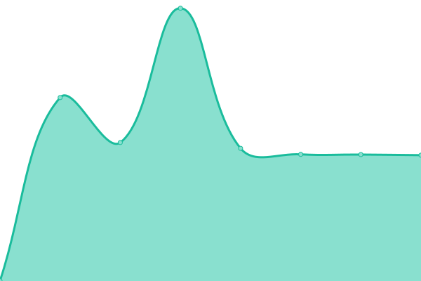

# [📈 Live Status](https://upptime.github.io/upptime): <!--live status--> **🟧 Partial outage**

This repository contains the open-source uptime monitor and status page for [Upptime](https://upptime.js.org), powered by [Upptime](https://github.com/upptime/upptime).

<!--start: status pages-->
<!-- This summary is generated by Upptime (https://github.com/upptime/upptime) -->
<!-- Do not edit this manually, your changes will be overwritten -->
<!-- prettier-ignore -->
| URL | Status | History | Response Time | Uptime |
| --- | ------ | ------- | ------------- | ------ |
|  [Synertech labs](https://synertech-labs.ch) | 🟥 Down | [synertech-labs.yml](https://github.com/SynerTech-Labs/Uptime/commits/HEAD/history/synertech-labs.yml) | 

 1140ms
     
 | 

<a href="https://SynerTech-Labs.github.io/Uptime/history/synertech-labs">100.00%</a>
    

|  [PrometheusAI](https://prometheusai.ch) | 🟩 Up | [prometheus-ai.yml](https://github.com/SynerTech-Labs/Uptime/commits/HEAD/history/prometheus-ai.yml) | 

 781ms
     
 | 

<a href="https://SynerTech-Labs.github.io/Uptime/history/prometheus-ai">100.00%</a>
    

|  [Gogym server](https://status.supabase.com/api/v2/status.json) | 🟥 Down | [gogym-server.yml](https://github.com/SynerTech-Labs/Uptime/commits/HEAD/history/gogym-server.yml) | 

 206ms
     
 | 

<a href="https://SynerTech-Labs.github.io/Uptime/history/gogym-server">55.79%</a>
    

<!--end: status pages-->

## 📄 License

- Powered by: [Upptime](https://github.com/upptime/upptime)
- Code: [MIT](./LICENSE) © [Anand Chowdhary](https://anandchowdhary.com), supported by [Pabio](https://pabio.com)
- Data in the `./history` directory: [Open Database License](https://opendatacommons.org/licenses/odbl/1-0/)
